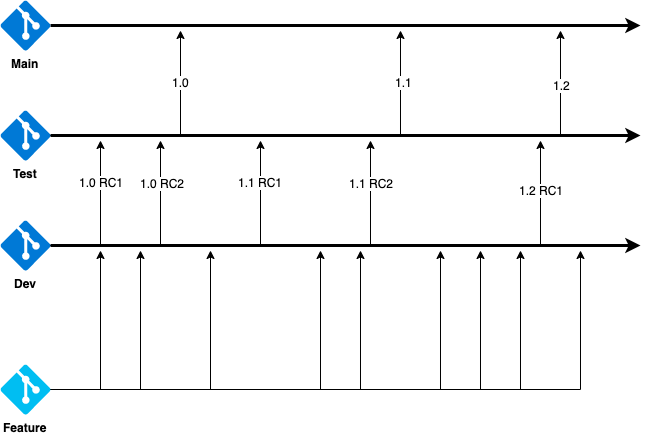
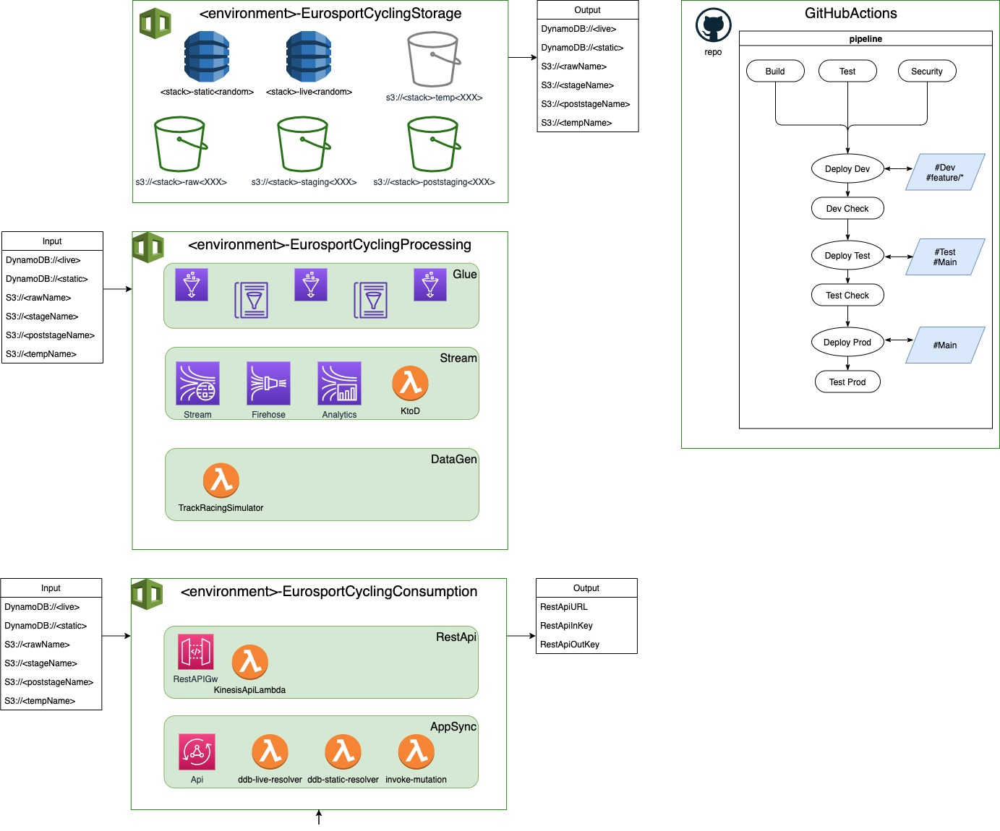

[](https://github.com/EurosportDigital/uci-tcl-aws/actions/workflows/pipeline.yml)
# Project team:
 * Adam Wiszniewski (AWS)
 * Sabina Przioda (AWS)
 * Jakub Kunc (AWS)

# Near-real time processing
This package defines all components and congiguration for real-time data processing for cycling competition.
Components are:
 * Data Lake
 * Real-time data processing
 * Data Analytics
 * Machine Learning (with pipeline)
 * GraphQL API
 * API Gateway
 * DynamoDB

Helpful resources:
 - [SonarCloud](https://sonarcloud.io/project/configuration?id=EurosportDigital_uci-tcl-aws)
 - [Jira](https://discoveryinc.atlassian.net/browse/UCITCL)

## GIT Flow



## Deployment Stacks and pipeline



## Clone the project
This is a private repository. For clonning you need [to create a personal token](https://github.blog/2013-09-03-two-factor-authentication/#how-does-it-work-for-command-line-git) and after make a clone.


1. Open [the personal token page](https://github.com/settings/tokens) and create a token
    1. Create a new token
    2. Set the name, expiration time and an access (repo and workflow)
    3. Click the "Generate token" button and save the token on your PC securely
    4. Click on the SSO and click on the button "Authorize".
    5. After signing you should see a message "Credential authorized to access Eurosport". Close by clicking "Continue"

2. To clone the repository use following example. Replace the name from example with _your GitHub user name_.

```
YOUR_GITHUB_USER='kzarudexternal'
git clone https://${YOUR_GITHUB_USER}@github.com/EurosportDigital/uci-tcl-aws.git
# Instead of your password copy-paste the token you've got on the step 1.
```

You should be able to clone the repository.


## Login to NPM repository


This is a private npm repository.


1. Open [the personal token page](https://github.com/settings/tokens) and create a token
    1. Create a new token with permissions: `read:packages` and `repo`
    2. Set the name, expiration time and an access (repo and workflow)
    3. Click the "Generate token" button and save the token on your PC securely
    4. Click on the SSO and click on the button "Authorize".
    5. After signing you should see a message "Credential authorized to access Eurosport". Close by clicking "Continue"

2. To login to npm repository use following example. 

`username` = your github username.
`password` = token you've just generated
`email` = your email address

```
 npm login --scope=@eurosportdigital --registry=https://npm.pkg.github.com        

# Instead of your password copy-paste the token you've got on the step 1.
```

You should be able to connect to private NPM repository.

## Manual development and deployment

### Install npm and aws-cdk
Install npm on MacOS:

Follow these [instructions (option 3)](https://www.newline.co/@Adele/how-to-install-nodejs-and-npm-on-macos--22782681#3-using-nvm-to-install-and-update-nodejs-recommended), but use the curl/wget provided at the [official github page of nvm](https://github.com/nvm-sh/nvm).


Install aws-cdk with npm
```
npm -g install aws-cdk
```

### Run local tests and cleanup
Below you can see a way how to launch tests
```
# Check if you can build
./build.sh

# Check static code analyzis and unit tests
./buildtest.sh

# Check for security issues
./buildtestsec.sh

# Cleanup the local repository
./cleanUp.sh

```

### Deploy solution to a dev account
Below you can see an example how to manually deploy service into the AWS
```
# Deployment
## Check NPM version on your PC. Should be v16. Otherwise, you need to update it via nvm
node --version

## Check AWS CDK toolkit. 1.117.0 or later. If not, install it via: sudo npm install -g aws-cdk
cdk --version

## Install modules. In the end you should see all stacks are ready to deploy
./build.sh

## Make sure you are in the dev account. It should be 678932323143
aws sts get-caller-identity

## How to connect to the account 678932323143
## Reference article https://discoveryinc.atlassian.net/wiki/spaces/LM/pages/1905034212/How+To+Get+AWS+CLI+credentials+using+gimme-aws-creds

### Install gimme-aws-creds
brew install gimme-aws-creds

### Change USERNAME to yours
USERNAME='konstantin_zarudaev.external@discovery.com'

### Create the ~/.okta_aws_login_config file for connection
cat > ~/.okta_aws_login_config << EOF
[uci-tcl-aws-dev]
app_url = https://discovery.okta.com/home/amazon_aws/0oa4id630pfZqa5p52p7/272
aws_default_duration = 36000
aws_rolename = arn:aws:iam::678932323143:role/trackcycling-developer
cred_profile = uci-tcl-aws-dev
gimme_creds_server = appurl
okta_org_url = https://discovery.okta.com
okta_username = $USERNAME
output_format = export
preferred_mfa_type = push
remember_device = True
resolve_aws_alias = True
write_aws_creds = True
EOF

### modify your AWS CLI profile
cat << EOF >> ~/.aws/config

[profile uci-tcl-aws-dev]
region = eu-west-1
output = json
EOF

### Auth with okta
gimme-aws-creds --profile uci-tcl-aws-dev

### Set the profile for AWS usage
export AWS_PROFILE=uci-tcl-aws-dev

### Check account connection. It should be 678932323143
aws sts get-caller-identity

## Deploy DEV stacks in the environment
cdk deploy dev-EurosportCyclingStorage
cdk deploy dev-EurosportCyclingConsumption
cdk deploy dev-EurosportCyclingProcessing
cdk deploy dev-EurosportCyclingDataGen

## Deploy TEST stacks in the environment
export DEPLOY_ENV='test'
cdk deploy test-EurosportCyclingStorage
cdk deploy test-EurosportCyclingProcessing

# !! Optional !!
## Copy content from other S3 buckets
SRS='eurosportcyclingstorage-raw1d6fb60a-1pomhw4kn38ax'
DST='eurosportcyclingstorage-raw1d6fb60a-p5tvl13cj2w3'
aws s3 cp s3://${SRS} s3://${DST} --recursive

################################
####### Do your tests ##########
################################

## Cleanup the environment
cdk destroy EurosportCyclingProcessing
cdk destroy EurosportCyclingStorage

## ! S3 buckets RAW, STAGING and POSTSTAGING are reamain in the account.
## ! You may delete them manually
aws s3 ls
bucketToDelete='eurosportcyclingstorage-raw1d6fb60a-1x3ggzgdfu2dm'
aws s3 rm s3://${bucketToDelete} --recursive
aws s3api delete-bucket --bucket ${bucketToDelete} --region eu-west-1

S3List=$(aws s3 ls | awk '{print $3}' | grep appstream)
echo $S3List
for bucketToDelete in $S3List; do
    aws s3 rm s3://${bucketToDelete} --recursive
    aws s3 rb "s3://${bucketToDelete}" --force
done

```
